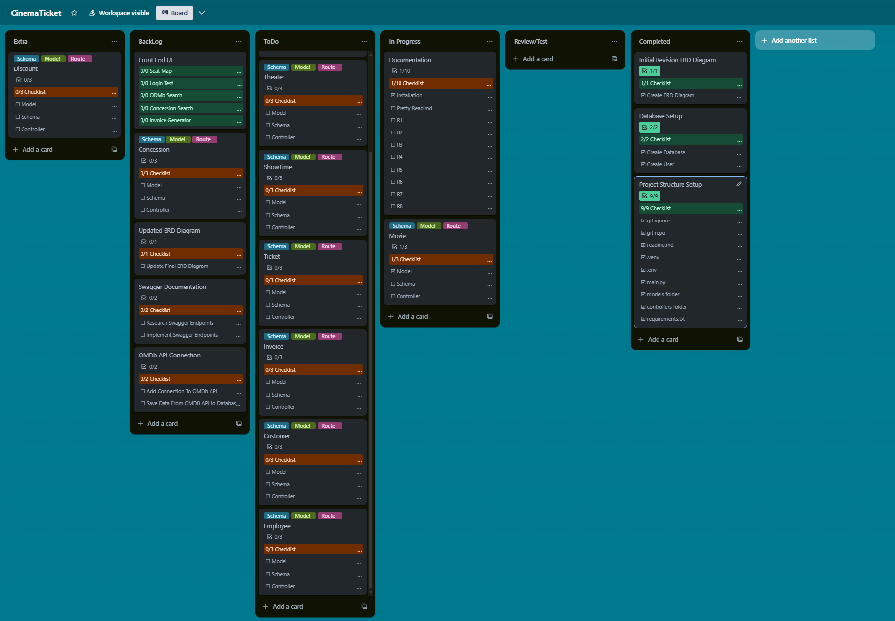
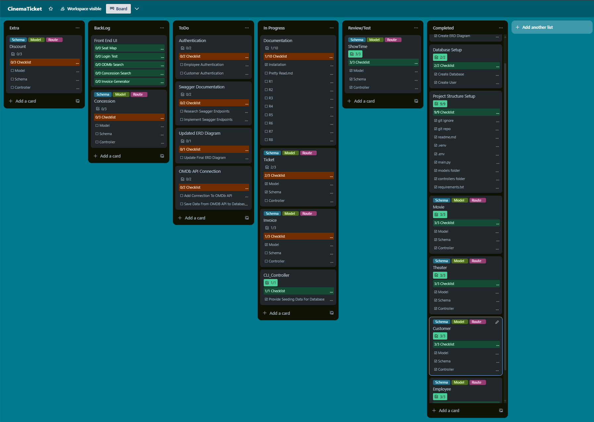
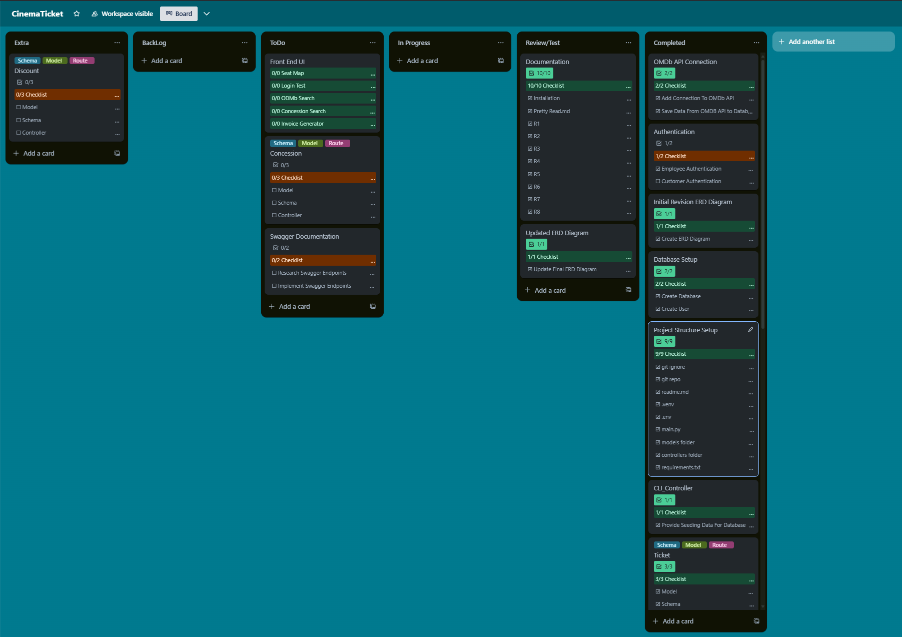
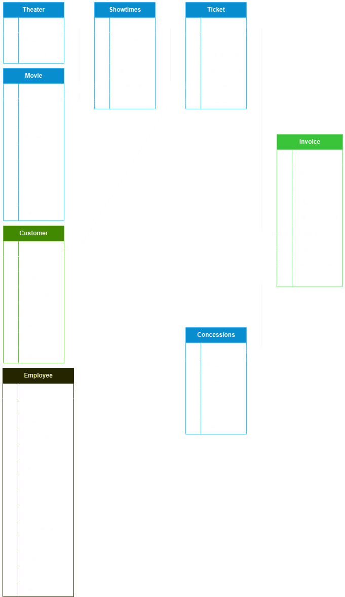
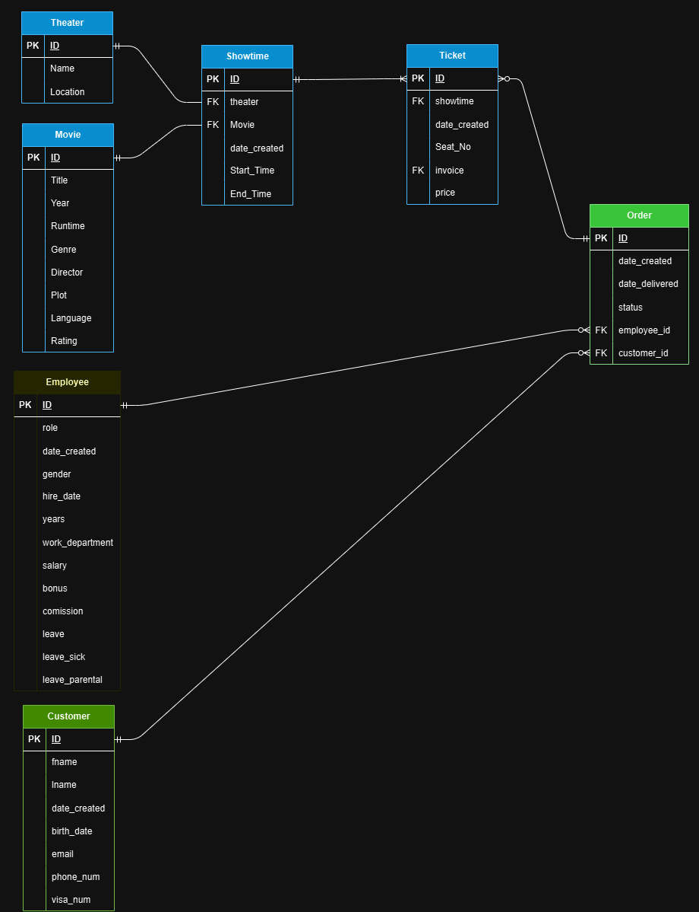

# Cinema_API_V1_Clean
[GitHub](https://github.com/R-Z-W/Cinema_API_V1_Clean/settings)

<h1>Installation</h1>

<h3>Setting Up Database </h3>
<details><summary><b>Instructions</b></summary>

1. Install <a url=https://www.postgresql.org/download/>PostgreSQL</a> if not already installed.
2. Open a terminal and type 
```sh 
sudo -u postgres psql
```
3. Create database called: cinema_db: 
```sh
CREATE DATABASE cinema_db;
```
4. Enter the database:
```sh 
\c cinema_db
```
5. Create a user called db_manager with a password: 
```sh
CREATE USER db_manager WITH PASSWORD '123456';
```
6. Create priviliges to user: 
```sh
GRANT ALL PRIVILEGES ON DATABASE cinema_db TO db_manager;
```
7. If Postgres permission denied for schema public. Input into terminal: 
```sh
GRANT ALL ON SCHEMA public TO db_manager;
```

EXTRA: 
- To remove database: 
```sh
DROP DATABASE cinema_db;
```
- To remove user: 
```sh
DROP USER db_manager;
```
</details>

<h3>Setting Up Flask</h3>
<details><summary><b>Instructions</b></summary>

1. Check for Python 3.10 or above via the terminal with: 
```sh
python --version
```
If not install <a url=https://www.python.org/downloads/>Python</a>

2. Clone repository in the terminal: 
```sh
git clone ...
```
3. Activate the virtual environment inside the cloned repository: 
```sh
source .venv/bin/activate
```
4. Install requirements: 
```sh
pip install -r requirements.txt
```
5. Place details of database in ```.env.sample``` and rename it to ```.env```:
```sh
DATABASE_URI= ...
JWT_SECRET_KEY= ...
OMDB_API_KEY= ... (only required for OMDb requests)
```
6. To create tables: 
```sh
flask db create
```
7. To seed tables: 
```sh
flask db seed
```
8. To drop tables:
```sh
flask db drop
```
9. To run server:
```sh
flask run
```
</details>
<br>

<h1>Questions</h1>
<h2>Explain the problem that this app will solve, and explain how this app solves or addresses the problem.</h2>

This project aims to create a centralized web platform for managing a movie theater business. It provides a way to combine and connect data from theaters and movies, to customers and employees and, the in-between with, invoices, showtimes and tickets. This platform streamlines the process of booking tickets, generating invoices, and keeping track of customer and movie information.

With the power of an API, various endpoints can be accessed in the browser allowing for multi-platform access to managing a cinema's operations.

<h2>Describe the way tasks are allocated and tracked in your project.</h2>

During the development of this back-end API, user-stories and a Kanban-Board approach were used to allocated and track tasks required for completing the project.

User-stories identified the underlying features required for the API project. Key features such as booking movies and creating tickets came from stories such as:
- As an employee:
    - I want to book movies in specific theaters so that customers have accurate scheduling information.
    - I want to view and manage ticket bookings so that customers can reserve a seat.

A Kanban Board was then created in Trello, to provide a clear visual platform to allocate and track tasks and features identified in the user-stories. Each task and feature had a checklist of sub-tasks which were needed to be completed in-order to complete the task or feature.

Different sections were setup to track task progress.
- Backlog and Extra contained features that I wanted to add but were not necessary for completing the project.
- ToDo contained all the necessary features that needed to be completed for a functioning API project.
- InProgess held features that were in a work in progress.
- Review/Test was a place to check if schemas and routes were working as expected, and if validators provided necessary correctness.
- Completed, the final section that held finished features.





<h2>List and explain the third-party services, packages and dependencies used in this app.</h2>

- Flask provided a web framework for Python which was the language used for this project. It was used as the foundation for building the API, allowing for the handling of HTTP requests and responses in the Project.

- SQLAlchemy is an object-relational mapping (ORM) tool that extends the capabilities of Flask allowing for the simplification of working with databases such as PostgresSQL. Direct SQL queries are no longer need as models (A Python object) are used to populate, modify, and delete tables within the Project's database.

- JWT is another extension for Flask that provides JSON Web Token (JWT) authentication and authorization. It was used for providing a uniquely identify for employees which allowed for authentication and role-based access control, identifying if employees had the manager role.

- Bcrypt, a password hashing library for securing employee passwords.

- requests is a library for making HTTP requests to APIs. It was used in this project when fetching movie data from the OMDb API.

- python-dotenv, a library for loading environment variables from the .env file. Used to load configuration variables such as database connection details and API keys.

- psycopg2 is a PostgreSQL database adapter for the project. It was used for used for connecting to and interacting with the PostgreSQL database.

- OMDb API is an online database that holds a wide range of information on movies. It was integrated into the Flask application to fetch and display movie data.

- Marshmallow:
Marshmallow is a Python library designed for the serialization and deserialization of data within the API. It allows for the conversion of complex data types, such as Python objects, to and from formats like JSON which is suitable for transmission over networks. Marshmallow employs schemas containing fields that define the structure of data during serialization or deserialization. These fields may include validation rules to ensure that the data meets specified criteria, ensuring data integrity and consistency in the API.


<h2>Explain the benefits and drawbacks of this app’s underlying database system.</h2>

The underlying database system that I chose for this app was PostgreSQL. Being a relational database, it was the perfect fit for containing the kind of data that my app was going to handle. It works on all major platforms (Windows, Linux, Mac), aligning with the my goal of multi-platform support, and being ACID compliant, it has an extensive track record of being reliable and durable. PostgresSQL is also scalable, supporting horizontal scaling through sharding and replication. It can handle large amounts of data and high concurrent usage, these are features needed for supporting multi location, Movie Theater businesses. With customer and employee data being stored in the database, PostgreSQL provides robust security features, including role-based access control, encryption, and authentication methods. But, with all the benefits that come with using PostgresSQL, there are still some drawbacks. PostgreSQL can be complex. It requires proper set up and configuration, especially when dealing with larger deployments. It requires careful planning and tuning to achieve optimal performance which can hinder its ability to be flexible. Lastly, while PostgreSQL is highly performant, in comparison to other database systems, such as NoSQL databases, it may not be the best choice for very large-scale applications with extremely high performance requirements.


<h2>Explain the features, purpose and functionalities of the object-relational mapping system (ORM) used in this app.</h2>

The object-relational mapping (ORM) system used in this app is SQLAlchemy. SQLAlchemy is a popular and extensive ORM library for Python that provides a way to interact with the project's PostgresSQL database, using Python objects. SQLAlchemy's features include object-relational mapping, which allows for the mapping of database tables to Python classes, providing a way to define the structure of database tables. 

```python
class Movie(db.Model):
    __tablename__ = "movies"

    id = db.Column(db.Integer, primary_key=True)
    title = db.Column(db.String(200), nullable=False)
    year = db.Column(db.Integer)
    runtime = db.Column(db.String(200))
    genre = db.Column(db.String(255))
    director = db.Column(db.String(100))
    plot = db.Column(db.Text)
    language = db.Column(db.String(255))
    rating = db.Column(db.Float)
```

Low-level SQL interactions are no longer needed, as SQLalchemy provides a consistent API for CRUD operations with querying, inserting, updating, and deleting the projects database data. SQLAlchemy integrates well with object-oriented programming principles, making it easier to organize and manage the codebase by defining the database schema using Python classes. 

```python
class MovieSchema(ma.Schema):
    
    showtimes = fields.List(fields.Nested('ShowtimeSchema'))

    class Meta:
        fields = ('title', 'year', 'runtime', 'genre', 'director', 'plot', 'language', 'rating')

movie_schema = MovieSchema()
movies_schema = MovieSchema(many=True)
```

It supports various types of relationships between database tables, such as one-to-one, one-to-many, many-to-one, and many-to-many, and provides a convenient way to manage these relationships using Python classes. 
```python
   showtimes = db.relationship('Showtime', back_populates='movie', cascade='all, delete')
```
The library offers querying and filtering capabilities, allowing for filtering, sorting, grouping, and aggregation of data through Python code.
```python
select(Movie).order_by(Movie.year)
```
  In summary, SQLAlchemy provides a powerful and convenient way to interact with databases using Python objects, simplifying the process of defining and managing database schemas, querying data, and performing CRUD operations.

<h2>Design an entity relationship diagram (ERD) for this app’s database, and explain how the relations between the diagrammed models will aid the database design. 
This should focus on the database design BEFORE coding has begun, eg. during the project planning or design phase.</h2>



- Theater: Represents a theater and has a one-to-many relationship with the Showtime entity. Each theater can have multiple showtimes throughout the day.
- Movie: Represents a movie and has a one-to-many relationship with the Showtime entity. Each movie can have multiple showtimes.
- Showtime: Represents a showtime and has a many-to-one relationship with both the Theater and Movie entities. Each showtime belongs to a specific theater and movie.
- Ticket: Represents a ticket and has a many-to-one relationship with the Showtime entity. Each Showtime must have one or multiple tickets representing the seats of a theater.
- Customer: Represents a customer and has a one-to-many relationship with the Invoice entity. As each customer can visit the cinema multiple times to watch different movies therefore needing to have multiple invoices.
- Employee: Represents an employee and has a one-to-many relationship with the Invoice entity. Each employee can create multiple invoices for each customer that visits the cinema.
- Concessions: Represents the concession stand at the cinema, this has a many to many relationship with Invoice as a concession can be on multiple invoices and an invoice can have multiple concessions.

<h2>Explain the implemented models and their relationships, including how the relationships aid the database implementation.
This should focus on the database implementation AFTER coding has begun, eg. during the project development phase.</h2>



During the project development phase, changes were made to simplify the development. Many models retained their attributes and relationships but some had to be trimmed to reduce complexity. In the end, the core functionality of the program was retained but some features were cut. In the end the implemented models result in:

<h3>Implemented Models</h3>
- theater: name, location
    - Did not change.

- movie: title, year, runtime, genre, director, plot, language, rating
    - Did not change

- showtimes: start_time, end_time, date_created, theater_id, movie_id
    - Did not change

- ticket: price, seat_number, date_created, showtime_id, invoice_id
    - invoice_id was added to allow for an invoice to have multiple tickets to support situations such as family ticket purchases.

- invoice: total_price, status, date_created, date_delivered, customer_id, employee_id
    - ticket_id was removed due to above.

- customer: Fname, Lname, DOB, Email, Phone, date_created
    - password was removed to simplify authentication in the project.

- employee: fname, lname, password, DOB, email, phone, role, department, salary, leave, leave_sick, date_created
    - is_Admin was removed as authorization now depended on the role of the employee in the company.

<h3>Implemented Relationships</h3>

- Theater: retained a one-to-many relationship with the Showtime model. Each theater supports multiple showtimes.

- Movie: retained a one-to-many relationship with the Showtime model. Each movie can have multiple showtimes.

- Showtime: a many-to-one relationship with both the Theater and Movie models was retained. Each showtime belongs to a specific theater and movie.

- Ticket: a many-to-one relationship with the Showtime model. Each ticket belongs to a specific showtime.

- Customer: A customer has a one-to-many relationship with the Invoice model. Each customer can have multiple invoices for each movie they watch.

- Employee: Represents an employee and has a one-to-many relationship with the Invoice model. Each employee can have multiple invoices for each customer.

- Invoice: Represents an invoice and has a many-to-one relationship with both the Customer and Employee models. Each invoice belongs to a specific customer and employee. Each invoice also has a one-to-many relationship with ticket allowing for multiple ticket purchases.

- Concession: Was removed to simplify the project and wasn't required to reach assignment requirements.


<h2>Explain how to use this application’s API endpoints. Each endpoint should be explained, including the following data for each endpoint:

HTTP verb
Path or route
Any required body or header data
Response</h2>

In this project, endpoints were used and tested using Insomnia an API testing tool. To use Insomnia, first install it [here](https://insomnia.rest/download)
Then import 'Insomnia_Cinema_API.json' located in the project directory.
Additionally, API endpoints can be used with the ```curl``` command in the terminal:
```curl -X GET http://localhost:8080/movies```.

<h2>Movie</h2>
<br>
GET /movies<br>
HTTP verb: GET<br>
Path or route: /movies<br>
Response: Returns a JSON response containing a list of all movies, along with their details such as title, year, runtime, genre, director, plot, language, and rating.
<br><br>
GET /movies/<br>
HTTP verb: GET<br>
Path or route: /movies/<movie_id><br>
Response: Returns a JSON response containing the details of a specific movie with the given ID.
<br><br>
POST /movies/omdb<br>
HTTP verb: POST<br>
Path or route: /movies/omdb<br>
Required body data: The request body should contain movie title.<br>
Response: Returns a JSON response containing the details of the newly created movie.
<br><br>
POST /movies<br>
HTTP verb: POST<br>
Path or route: /movies<br>
Required body data: The request body should contain the movie details such as title, year, runtime, genre, director, plot, language, and rating.<br>
Response: Returns a JSON response containing the details of the newly created movie.
<br><br>
PUT /movies/<movie_id><br>
HTTP verb: PUT<br>
Path or route: /movies/<movie_id><br>
Required body data: The request body should contain the updated movie details such as title, year, runtime, genre, director, plot, language, and rating.<br>
Response: Returns a JSON response indicating the success of the update operation.
<br><br>
DELETE /movies/<movie_id><br>
HTTP verb: DELETE<br>
Path or route: /movies/<movie_id><br>
Response: Returns a JSON response indicating the success of the delete operation.
<br><br>

<h2>Theater</h2>
GET /theaters <br>
HTTP verb: GET <br>
Path or route: /theaters <br>
Response: Returns a JSON response containing a list of all theaters, along with their details such as name and location.
<br><br>
GET /theaters/ <br>
HTTP verb: <br>
GET Path or route: /theaters/ <br>
Required path parameter: Theater ID <br>
Response: Returns a JSON response containing the details of a specific theater with the given ID.
<br><br>
POST /theaters <br>
HTTP verb: POST <br>
Path or route: /theaters <br>
Required body data: The request body should contain the theater details such as name and location. <br>
Response: Returns a JSON response containing the details of the newly created theater.
<br><br>
PUT /theaters/<theater_id><br>
HTTP verb: PUT<br>
Path or route: /theaters/<theater_id><br>
Required body data: The request body should contain the updated theater details such as name and location.<br>
Response: Returns a JSON response indicating the success of the update operation.
<br><br>
DELETE /theaters/<theater_id><br>
HTTP verb: DELETE<br>
Path or route: /theaters/<theater_id><br>
Response: Returns a JSON response indicating the success of the delete operation.
<br><br>

<h2>Showtime</h2>
GET /showtimes<br> 
HTTP verb: GET <br>
Path or route: /showtimes <br>
Response: Returns a JSON response containing a list of all showtimes, along with their details such as start time, end time, theater ID, movie ID, and price.
<br><br>
GET /showtimes/ <br>
HTTP verb: GET <br>
Path or route: /showtimes/ <br>
Required path parameter: Showtime ID <br>
Response: Returns a JSON response containing the details of a specific showtime with the given ID.
<br><br>
POST /showtimes <br>
HTTP verb: POST <br>
Path or route: /showtimes <br>
Required body data: The request body should contain the showtime details such as start time, end time, theater ID, movie ID, and price. <br>
Response: Returns a JSON response containing the details of the newly created showtime.
<br><br>
PUT /showtimes/<showtime_id><br>
HTTP verb: PUT<br>
Path or route: /showtimes/<showtime_id><br>
Required body data: The request body should contain the updated showtime details such as movie ID, start time, and end time.<br>
Response: Returns a JSON response indicating the success of the update operation.
<br><br>
DELETE /showtimes/<showtime_id><br>
HTTP verb: DELETE<br>
Path or route: /showtimes/<showtime_id><br>
Response: Returns a JSON response indicating the success of the delete operation.
<br><br>

<h2>Ticket</h2>
GET /tickets <br>
HTTP verb: GET <br>
Path or route: /tickets <br>
Response: Returns a JSON response containing a list of all tickets, along with their details such as name, price, and showtime ID.
<br><br>
GET /tickets/ <br>
HTTP verb: GET <br>
Path or route: /tickets/ <br>
Required path parameter: Ticket ID <br>
Response: Returns a JSON response containing the details of a specific ticket with the given ID.
<br><br>
POST /tickets <br>
HTTP verb: POST <br>
Path or route: /tickets <br>
Required body data: The request body should contain the ticket details such as name, price, and showtime ID. <br>
Response: Returns a JSON response containing the details of the newly created ticket.
<br><br>
PUT /tickets/<ticket_id><br>
HTTP verb: PUT<br>
Path or route: /tickets/<ticket_id><br>
Required body data: The request body should contain the updated ticket details such as price, seat number, showtime ID, and invoice ID.<br>
Response: Returns a JSON response indicating the success of the update operation.
<br><br>
DELETE /tickets/<ticket_id><br>
HTTP verb: DELETE<br>
Path or route: /tickets/<ticket_id><br>
Response: Returns a JSON response indicating the success of the delete operation.
<br><br>

<h2>Invoice</h2>
GET /invoices<br>
HTTP verb: GET<br>
Path or route: /invoices<br>
Response: Returns a JSON response containing a list of all invoices, along with their details such as invoice number, date, total, and customer ID.
<br><br>
GET /invoices/<invoice_id><br>
HTTP verb: GET<br>
Path or route: /invoices/<invoice_id><br>
Response: Returns a JSON response containing the details of a specific invoice with the given ID.
<br><br>
POST /invoices<br>
HTTP verb: POST<br>
Path or route: /invoices<br>
Required body data: The request body should contain the invoice details such as invoice number, date, total, and customer ID.<br>
Response: Returns a JSON response containing the details of the newly created invoice.
<br><br>
PUT /invoices/<invoice_id><br>
HTTP verb: PUT<br>
Path or route: /invoices/<invoice_id><br>
Required body data: The request body should contain the updated invoice details such as invoice number, date, total, and customer ID.<br>
Response: Returns a JSON response indicating the success of the update operation.
<br><br>
DELETE /invoices/<invoice_id><br>
HTTP verb: DELETE<br>
Path or route: /invoices/<invoice_id><br>
Response: Returns a JSON response indicating the success of the delete operation.
<br><br>

<h2>Customer</h2>
GET /customers<br>
HTTP verb: GET<br>
Path or route: /customers<br>
Response: Returns a JSON response containing a list of all customers, along with their details such as first name, last name, email, and phone number.
<br><br>
GET /customers/<customer_id><br>
HTTP verb: GET<br>
Path or route: /customers/<customer_id><br>
Response: Returns a JSON response containing the details of a specific customer with the given ID.
<br><br>
POST /customers<br>
HTTP verb: POST<br>
Path or route: /customers<br>
Required body data: The request body should contain the customer details such as first name, last name, email, and phone number.<br>
Response: Returns a JSON response containing the details of the newly created customer.
<br><br>
PUT /customers/<customer_id><br>
HTTP verb: PUT<br>
Path or route: /customers/<customer_id><br>
Required body data: The request body should contain the updated customer details such as first name, last name, email, and phone number.<br>
Response: Returns a JSON response indicating the success of the update operation.
<br><br>
DELETE /customers/<customer_id><br>
HTTP verb: DELETE<br>
Path or route: /customers/<customer_id><br>
Response: Returns a JSON response indicating the success of the delete operation.
<br><br>

<h2>Employee</h2>
GET /employees<br>
HTTP verb: GET<br>
Path or route: /employees<br>
Response: Returns a JSON response containing a list of all employees, along with their details such as first name, last name, email, and phone number.
<br><br>
GET /employees/<employee_id><br>
HTTP verb: GET<br>
Path or route: /employees/<employee_id><br>
Response: Returns a JSON response containing the details of a specific employee with the given ID.
<br><br>
POST /employees<br>
HTTP verb: POST<br>
Path or route: /employees<br>
Required body data: The request body should contain the employee details such as first name, last name, email, and phone number.<br>
Response: Returns a JSON response containing the details of the newly created employee.
<br><br>
PUT /employees/<employee_id><br>
HTTP verb: PUT<br>
Path or route: /employees/<employee_id><br>
Required body data: The request body should contain the updated employee details such as first name, last name, email, and phone number.<br>
Response: Returns a JSON response indicating the success of the update operation.
<br><br>
DELETE /employees/<employee_id><br>
HTTP verb: DELETE<br>
Path or route: /employees/<employee_id><br>
Response: Returns a JSON response indicating the success of the delete operation.